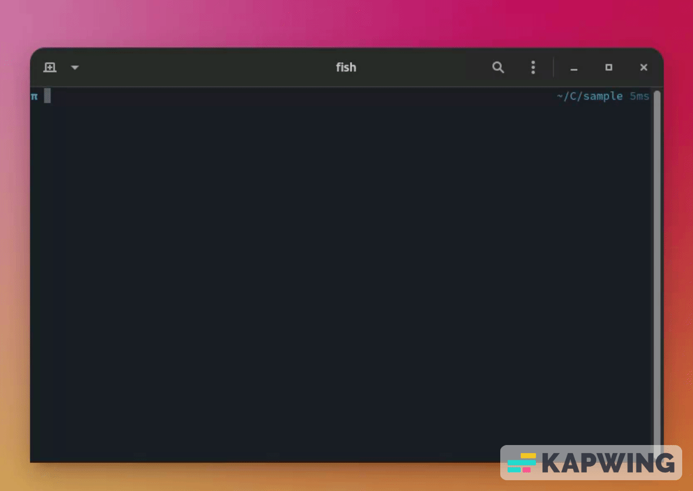

 

  
    
  

    <b>
      Open source live server written in GO✨
    </b>
  

  

    
  

## Installation

#### Linux and macOS

1. <a href="https://github.com/reenphygeorge/servette/releases/tag/v1.0.0">Download</a> and unzip the executable
2. Open the folder in terminal and run the following to grant execute permissions

   chmod +x install.sh

3. Run the installer

   sudo ./install.sh

4. Run the executable

   srt

#### Windows

1. <a href="https://github.com/reenphygeorge/servette/releases/tag/v1.0.0">Download</a> and unzip the executable
2. Add path to environment variables
3. Run the executable

   srt

## Extend

Use <a href="https://github.com/reenphygeorge/servette/blob/main/srt.config.json">srt.config</a> file in your project to modify values like `port` `Skip Directories` 

###### By default skips .git directory no need to add it again.
